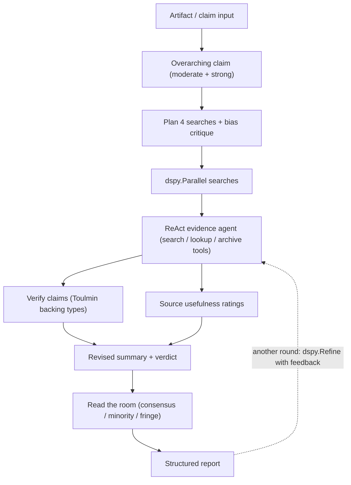

# Rebuilding SIFT & Deep Background as a DSPy Pipeline

A deep-research brief on the methodologies DSPy offers for converting the two uploaded fact-checking skills — SIFT (Stop / Investigate the source / Find better coverage / Trace claims) and Deep Background (Toulmin-structured claim analysis with multi-pass "another round" refinement) — from prose prompt files into typed, optimizable, evaluable programs.

---

## Question

How can the SIFT and Deep Background skills be transformed into a DSPy pipeline, and which DSPy methodologies (modules, optimizers, evaluation, constraint mechanisms) are the right fit for each stage of the fact-checking workflow they encode?

**Scope:** DSPy as of its current documentation (dspy.ai learn/tutorials, indexed September 2026); the two uploaded skill files as source material; pipeline architecture and methodology selection, not a full production implementation.

---

## Executive Summary

1. **The transformation is direct, not metaphorical.** DSPy's own homepage uses a `FactCheck` module — `find` (article → claims) followed by `verify` (claim + source → verdict) — as a flagship example of composing typed sub-modules in plain Python. SIFT and Deep Background are already structured as claim → evidence → verdict pipelines; they are prose-encoded DSPy programs waiting to happen.
2. **There is a near-exact precedent in DSPy's tutorials.** The multi-hop search agent tutorial builds a `dspy.ReAct` fact-checking agent over the HoVer dataset (given a complex claim, retrieve all Wikipedia pages needed to fact-check it), scoring 8% top-5 recall with a small LM, rising to ~42% after joint prompt optimization with MIPROv2. This is the "Trace claims" move of SIFT, already built and benchmarked.
3. **Every SIFT/Deep Background output section maps to a typed Signature.** The Verified Facts, Errors & Corrections, Source Assessment, and Potential Leads tables, the moderate/strong overarching-claim distinction, the Toulmin backing-type taxonomy, and the "read the room" verdict categories (consensus / majority-minority / competing theories / uncertainty / fringe) each become a `dspy.Signature` with typed output fields. The skill's formatting rules become `dspy.Suggest` constraints.
4. **The optimizer ecosystem is the real prize.** Moving from hand-written skill prose to DSPy unlocks BootstrapFewShot → MIPROv2 → GEPA, where GEPA is distinctive because it consumes natural-language *feedback* per predictor — which is exactly what a fact-checking rubric produces. Third-party benchmarks report GEPA beating MIPROv2 by over 10% on some tasks.
5. **"Another round" has a native DSPy counterpart.** `dspy.Refine` re-runs a failed attempt with generated, per-predictor feedback injected as hints — a built-in mechanism for the Deep Background skill's multi-pass "fact-check the fact-check" loop. Assertions are deprecated in favor of `Refine`/`Suggest`.
6. **Some pieces should stay outside DSPy.** Interactive behaviors (asking the user to pick or modify searches), hotkey templates (`context report`, `cnote`, `discourse map`), and citation-link rendering are host-orchestration concerns; DSPy should own the reasoning steps, not the chat UX.
7. **Experimental but notable:** DSPy now ships an online RL path (Arbor/GRPO) for multi-hop research programs and a `Flex` module whose entire implementation GEPA can rewrite. Both are labeled experimental but are directly aimed at exactly this class of agentic research task.

---

## Methodology

- **Sources:** the two user-provided skill files (read in full); the selected indexed libraries `dspy-learn` (185 docs) and `dspy-tutorials` (185 docs) covering dspy.ai's learn and tutorial sections; plus targeted web searches on DSPy optimizers and fact-checking pipelines.
- **Search angles:** DSPy's core programming model (signatures, modules, adapters); the module catalog (reasoning, tool-use, sampling, refinement); the optimizer catalog and selection guide; evaluation and datasets for claim verification; constraint/validation mechanisms; and direct precedents for fact-checking agents.
- **Approach:** broad mapping first (library semantic searches across ten methodology areas), then deep reads of the highest-relevance pages: the agents/fact-checking tutorial, the multi-hop retrieval tutorial, the online RL for multi-hop research tutorial, the built-in module variants deep-dive, and the optimizer selection guide.
- **Limitations:** library documents carry no publication dates, so recency is inferred from content (the docs reference DSPy 3.4/3.5 deprecations and a December 2025 arXiv release, suggesting a current snapshot). No hands-on benchmarking was performed; performance figures cited are from DSPy's own tutorials and third-party blogs, not independently verified. Cost figures for optimizers are indicative.

---

## Findings

### 1. The core programming model: what replaces the prose skill file

DSPy programs are built from three primitives that together replace a hand-written prompt document:

- **Signatures** — declarative typed task definitions. An input/output contract (e.g., `claim, source -> verdict`), with a docstring as the natural-language instruction and Pydantic-typed `InputField`/`OutputField` definitions. Instructions become optimizable parameters rather than frozen prose.
- **Modules** — composable building blocks (`Predict`, `ChainOfThought`, `ReAct`, …) that consume signatures. Arbitrary Python composition in a `dspy.Module.forward()` is the orchestration layer; a `FactCheck` class on the DSPy homepage chains a claim-extraction `ChainOfThought` with a per-claim verification `ChainOfThought` in nine lines.
- **Adapters** — the layer that renders signatures into the LM's actual prompt format, so the program is portable across models without rewriting prompts.

For SIFT and Deep Background, the skill markdown's role descriptions, table schemas, and section-ordering rules decompose into: signatures (one per output section), module composition (the response flow), and constraints (`Suggest` checks — see Finding 5).

### 2. Direct precedent: DSPy's multi-hop fact-checking agent

The strongest single anchor is the [multi-hop search agent tutorial](https://dspy.ai/tutorials/agents/):

- Task: HoVer dataset — input is a complex multi-hop claim, target output is the set of Wikipedia pages needed to fact-check it.
- Agent: `dspy.ReAct` with two plain-Python tools, `search_wikipedia(query)` and `lookup_wikipedia(title)`, backed by ColBERTv2/BM25 retrieval over the 2017 Wikipedia-abstracts corpus.
- Result: a Llama-3.2-3B agent scored **8% top-5 recall** zero-shot; after `MIPROv2(metric=top5_recall, auto="medium")` jointly optimized the agent's prompts, **recall rose to ~42%** — for roughly $5 of GPT-4o teacher calls.
- The companion [multi-hop retrieval tutorial](https://dspy.ai/tutorials/multihop_search/) shows the same task built with explicit composed sub-modules (`MultiHop` with hop-wise query generation) instead of an agent, using Llama-3.1-8B with MLflow tracing for inspectability.

This is SIFT's "Trace claims, quotes, and media to the original context" move, already implemented, evaluated, and optimized. The retrieval corpus and the recall metric are directly reusable for a SIFT pipeline.

### 3. Mapping SIFT's four moves and Deep Background's structure onto DSPy

| Skill element | DSPy methodology | Notes |
|---|---|---|
| Overarching claim (moderate + strong versions) | `ChainOfThought` signature with two output fields (`moderate_claim`, `strong_claim`) | The "state the likely overarching claim in both versions" instruction becomes a typed two-field output |
| Stop / initial claim analysis | `Predict` or `ChainOfThought` extraction | Cheap first pass; the homepage `FactCheck` pattern (`article -> claims: list[str]`) is the template |
| Investigate the source | `dspy.ReAct` with tools (`search`, `open_url`, archive lookups) | Tools are plain Python functions with type hints and docstrings; DSPy presents them to the LM automatically |
| Find better coverage / four-search preview | Signature emitting four candidate queries + a bias self-critique, then `dspy.Parallel` execution | The skill's "preview four possible searches then critique how they might bias results" becomes one signature call followed by parallel tool calls |
| Trace claims / multi-hop verification | `ReAct` multi-hop agent or explicit `ResearchHop`-style module | Benchmark exists (HoVer); see Finding 2 |
| Verified Facts / Errors / Leads tables | Typed signatures (`list[dict]` output fields) | DSPy output fields parse against JSON schemas; the tutorial's `titles: list[str]` field shows list-typed outputs enforced natively |
| Toulmin analysis + evidence-type taxonomy | Classification-style signature over enumerated labels | Same pattern as the [classification tutorial](https://dspy.ai/tutorials/classification/); the evidence-type table (Documentation / Testimony / Statistics / Analysis / Reporting / Common Knowledge) is a closed label set |
| Source usefulness ratings (1–5, emoji flags) | Typed output fields with numeric/enum constraints + `Suggest` validation | Ratings become structured outputs; format rules become runtime constraints |
| Read the room (consensus / majority-minority / competing / uncertainty / fringe) | Classification signature over the five discourse categories | Closed label set, ideal for few-shot optimization |
| State-controlled media asterisk rule | Deterministic Python check + `Suggest` | Rule-based logic belongs in code, not the LM |
| Revised Summary / Verdict | `ChainOfThought` with the verified-facts table as typed input | Downstream sections consume upstream typed outputs |
| "Another round" second pass | `dspy.Refine` (feedback-driven retry) or an explicit outer module | See Finding 5 |
| Photo analysis / provenance | `dspy.Image` input field + ReAct tools for Alamy/Getty/Granger archive search | DSPy supports image inputs natively (`dspy.Image` in signatures); archive searches are custom tools |
| Templates (`context report`, `cnote`, `discourse map`) | Separate small programs, orchestrated by the host | `discourse map` (d3 visualization) could use `ProgramOfThought`/code generation, but rendering is host-side |

### 4. The module catalog: the methodology menu

From the [built-in module variants deep-dive](https://dspy.ai/diving-deeper/built-in-module-variants/) and module API docs:

- **Reasoning:** `Predict` (direct), `ChainOfThought` (adds a reasoning field before the answer; configurable rationale field).
- **Tool use / agents:** `ReAct` — iterative reasoning-and-acting over typed tools, with trajectory tracking; used in the fact-checking tutorial. The [customer-service tutorial](https://dspy.ai/tutorials/customer_service_agent/) and [MCP tutorial](https://dspy.ai/tutorials/mcp/) show tool ecosystems in more depth.
- **Code execution:** `ProgramOfThought` (generate → execute → repair Python, three internal `ChainOfThought` predictors), `CodeAct` (ReAct + ProgramOfThought hybrid; deprecated in v3.4 in favor of `RLM`), and experimental `RLM` (a code sandbox with built-in `llm_query` tools — "a Python REPL the LM drives"). Relevant for the discourse-map template and any statistical checking of claims.
- **Sampling & aggregation:** `BestOfN(module, N, reward_fn, threshold)` — runs N isolated attempts at temperature 1.0, scores with a reward function, short-circuits on threshold; `majority()` — a no-LM aggregator for discrete answers; `MultiChainComparison(signature, M)` — synthesizes one answer across M pre-generated reasoning attempts. These map to running several search/evidence passes and adjudicating among them — the "find better coverage" and "handle contradictions" rules.
- **Refinement:** `Refine(module, N, reward_fn, threshold)` — after a failed attempt, builds a snapshot of module source, signatures, I/O traces, and the reward function, asks an internal predictor for advice, and injects per-predictor `hint_` fields on the retry. This is a first-class mechanism for the multi-pass "another round" workflow.
- **Composition:** `dspy.Parallel` for concurrent execution; plain-Python composition for everything else.
- **`Flex` (experimental):** holds its own implementation as source code and lets `dspy.GEPA` rewrite the *entire module implementation* — how many predictors, which primitives — against the metric, rather than only tuning instructions.

### 5. Constraints and self-checking: from formatting rules to `Suggest`

DSPy Assertions are now **deprecated in favor of `dspy.Refine` and `dspy.Suggest`** ([assertions guide](https://dspy.ai/learn/programming/7-assertions/)):

- `dspy.Suggest(constraint, msg)` — soft validation: retries with the failure message fed back as guidance; if constraints still fail after max backtracking attempts, the program continues with the last output.
- The retry/backtrack machinery targets a specific module for re-running.

For the skills, every mechanical QA rule — section order, exact table headers, en-dashes in rating ranges, citation format, "all links hot" — becomes `Suggest` constraints, so the compiled program enforces its own response template. This replaces the skills' "Quality Assurance: before submitting, verify…" checklist with executable checks.

### 6. Evaluation: the fact-checking metrics already exist

- `dspy.Evaluate(devset, metric, num_threads, display_table)` runs parallel scoring; results export to CSV/JSON and integrate with MLflow tracing (the tutorials instrument every run).
- The HoVer tutorials define **top-5 recall over gold supporting-fact titles** — a ready-made metric for the evidence-gathering stage. The RAG tutorial demonstrates semantic-F1 for answer quality.
- External benchmarks fit the same slot: FACT5 (FEVER-2025 workshop) offers nuanced fact-checking pipeline evaluation; claim-detection surveys describe the standard extraction → prioritization → verification pipeline stages that both skills mirror.
- Per the optimizer guide, 30–300 examples per split is the recommended scale for train/dev — a fact-checking pipeline can be bootstrapped from a few hundred labeled claims.

### 7. The optimizer ladder: what to compile with, and when

From the [optimizer selection guide](https://dspy.ai/diving-deeper/choosing-an-optimizer/) and [optimizers learn track](https://dspy.ai/learn/optimization/optimizers/):

- **Every optimizer tunes instructions, demos, or weights.** Prompt-only optimizers (BootstrapFewShot, COPRO, MIPROv2, GEPA) work with any LM including closed-source providers; `BootstrapFinetune` requires a tunable model.
- **Recommended ladder:** `LabeledFewShot(k=16)` (zero LM calls, honest baseline) → `BootstrapFewShot` (runs the program, keeps metric-passing traces as demos — "almost always beats zero-shot when the metric is reliable") → `BootstrapRS` / `KNNFewShot` (demo-set search; KNN picks demos per-inference via embeddings) → instruction optimizers.
- **MIPROv2** jointly optimizes instructions and few-shot demos, with `auto=light/medium/heavy` budget presets; the fact-checking agent tutorial used `auto="medium"` for its 8%→42% jump.
- **GEPA** is the only optimizer that reads `Prediction(score, feedback)` — it threads natural-language critique from each metric call into the next instruction proposal. A fact-checking rubric ("missed the strong version of the overarching claim", "rated a fringe source 4/5") is precisely feedback-rich, making GEPA arguably the best-matched optimizer for this pipeline. Caveat from the guide: without a feedback-rich metric, COPRO/MIPROv2 may give better mileage per dollar.
- **BetterTogether** composes sub-module optimization; the `_compiled=True` flag enables "optimize inner → embed in outer → optimize outer" — useful for compiling each SIFT stage separately before compiling the whole pipeline.
- **Cost reality:** GEPA and MIPROv2 can spend hundreds of dollars in LM calls on a single compile; the economics only work via "compile once, save, reload" (`program.save(path)`). Third-party comparisons report GEPA beating MIPROv2 by over 10% on some tasks and outperforming GRPO by up to 20% with up to 35× fewer rollouts on Qwen3-8B.
- **Experimental frontier:** the [online RL tutorial](https://dspy.ai/tutorials/rl_multihop/) trains a `ResearchHop` multi-hop claim-verification program (BM25 retrieval, `num_hops=2`) with Arbor GRPO on a local Qwen2.5-1.5B — explicitly labeled "new and extremely EXPERIMENTAL."

### 8. A concrete pipeline sketch

```python
import dspy


class OverarchingClaim(dspy.Signature):
    """Identify what the presented facts are meant to be evidence OF."""

    artifact: str = dspy.InputField()
    moderate_claim: str = dspy.OutputField(desc="limited version")
    strong_claim: str = dspy.OutputField(desc="expansive version")


class PlanSearches(dspy.Signature):
    """Propose four searches, then critique each for likely bias."""

    claim: str = dspy.InputField()
    queries: list[str] = dspy.OutputField(desc="exactly four")
    bias_critique: str = dspy.OutputField(desc="how each query could skew results")


class EvidenceAgent(dspy.Signature):
    """Find sources that substantiate or invalidate the claim."""

    claim: str = dspy.InputField()
    titles: list[str] = dspy.OutputField()


class VerifyClaims(dspy.Signature):
    """Verdict per claim with evidence type (Toulmin backing)."""

    claim: str = dspy.InputField()
    evidence: str = dspy.InputField()
    status: str = dspy.OutputField(desc="correct | incorrect | unsubstantiated | opinion")
    backing_type: str = dspy.OutputField(
        desc="documentation | testimony | statistics | analysis | reporting | common_knowledge"
    )
    confidence: int = dspy.OutputField(ge=1, le=5)


class SiftPipeline(dspy.Module):
    def __init__(self):
        self.claim = dspy.ChainOfThought(OverarchingClaim)
        self.plan = dspy.ChainOfThought(PlanSearches)
        self.evidence = dspy.ReAct(EvidenceAgent, tools=[search_web, open_url, search_archive])
        self.verify = dspy.ChainOfThought(VerifyClaims)
        self.assess_sources = dspy.ChainOfThought(AssessSources)  # ratings table
        self.synthesize = dspy.ChainOfThought(RevisedSummary)  # summary + verdict
        self.read_room = dspy.ChainOfThought(ReadTheRoom)  # consensus..fringe

    def forward(self, artifact):
        c = self.claim(artifact=artifact)
        p = self.plan(claim=c.moderate_claim)
        # run the four (bias-critiqued) searches in parallel
        docs = dspy.Parallel(4)([lambda q=q: search_web(q) for q in p.queries])
        ev = self.evidence(claim=c.strong_claim)
        verdicts = [self.verify(claim=cl, evidence=ev) for cl in extracted_claims]
        # dspy.Suggest() constraints enforce table formats, ratings ranges, section order
        return self.synthesize(verdicts=verdicts, sources=ev)
```

Flow of the full system:



### 9. What should stay outside DSPy

- **Interaction:** the skills' "ask the user to choose or modify searches" step is host-orchestration; a DSPy program is a function call, not a conversation. Expose the planned searches as a typed output and let the host pause for user input.
- **Templates and hotkeys:** `context report`, `cnote`, `discourse map` are separate output programs; `discourse map`'s d3 rendering is a frontend concern. The 700-character community-note constraint, by contrast, is a perfect `Suggest`.
- **Citation link rendering:** link hygiene (hot links, exact URLs) is enforced by `Suggest` but rendered host-side.

---

## Source Notes

| Source | Credibility | Last updated |
|---|---|---|
| [DSPy homepage (FactCheck example, module/optimizer overview)](https://dspy.ai/) | 5/5 | - |
| [DSPy tutorial: multi-hop search agent (HoVer fact-checking, ReAct, MIPROv2)](https://dspy.ai/tutorials/agents/) | 5/5 | - |
| [DSPy tutorial: multi-hop retrieval (MultiHop module, MLflow)](https://dspy.ai/tutorials/multihop_search/) | 5/5 | - |
| [DSPy tutorial: online RL for multi-hop research (Arbor GRPO)](https://dspy.ai/tutorials/rl_multihop/) | 5/5 | - |
| [DSPy deep-dive: built-in module variants (BestOfN, Refine, MultiChainComparison, Flex, RLM)](https://dspy.ai/diving-deeper/built-in-module-variants/) | 5/5 | - |
| [DSPy deep-dive: choosing an optimizer](https://dspy.ai/diving-deeper/choosing-an-optimizer/) | 5/5 | - |
| [DSPy learn: assertions (deprecated → Refine/Suggest)](https://dspy.ai/learn/programming/7-assertions/) | 5/5 | - |
| [DSPy learn: optimizers](https://dspy.ai/learn/optimization/optimizers/) | 5/5 | - |
| [DSPy API: dspy.ReAct](https://dspy.ai/api/modules/ReAct/) | 5/5 | - |
| [DSPy API: dspy.Evaluate](https://dspy.ai/api/evaluation/Evaluate/) | 5/5 | - |
| [DSPy getting started: GEPA optimization](https://dspy.ai/getting-started/gepa-optimization/) | 5/5 | - |
| [DSPy tutorial: RAG (semantic F1, MLflow)](https://dspy.ai/tutorials/rag/) | 5/5 | - |
| [DSPy tutorial: classification](https://dspy.ai/tutorials/classification/) | 5/5 | - |
| [DSPy tutorial: customer service agent](https://dspy.ai/tutorials/customer_service_agent/) | 5/5 | - |
| [Particula: MIPROv2 vs GEPA comparison](https://particula.tech/blog/dspy-gepa-vs-miprov2-automatic-prompt-optimization) | 3/5 | - |
| [FutureAGI: DSPy optimizers explained](https://futureagi.com/blog/dspy-optimizers-explained/) | 3/5 | - |
| [FACT5 benchmark paper (ACL Anthology, FEVER 2025)](https://aclanthology.org/2025.fever-1.8.pdf) | 4/5 | - |
| Sift-SKILL.md (user upload, `/home/user/uploads/Sift-SKILL.md`) | 5/5 (as source of requirements) | - |
| DeepBackground-SKILL.md (user upload, `/home/user/uploads/DeepBackground-SKILL.md`) | 5/5 (as source of requirements) | - |

**Caveats and conflicts:**

- DSPy documentation pages carry no visible publication dates; the indexed snapshot references v3.4/3.5 deprecations (`CodeAct` → `RLM`, Assertions → `Refine`/`Suggest`) and a December 2025 release, so it is current as of roughly early-to-mid 2026. Verify against the live docs before committing to an API.
- Performance claims (8%→42% recall; GEPA +10% over MIPROv2; ~75× cost reduction at Shopify) come from DSPy's own tutorials/blog and vendor-adjacent blogs — directionally credible but not independently audited here.
- Third-party optimizer comparisons (Particula, FutureAGI, SUPEROPTIX) use differing tasks and budgets; treat their rankings as indicative, not settled.
- The online RL path (Arbor) is explicitly flagged by DSPy as "pure proof of concept and development mode."

---

## Open Questions

1. **Training data:** will you annotate your own claims (30–300 examples per split is the recommended scale), or adapt HoVer/FEVER-style public datasets? The evidence-retrieval stage has ready datasets; the "read the room" and Toulmin stages would need custom labels.
2. **Metric design for verdict quality:** recall-over-gold-titles works for retrieval; the verdict stage needs a rubric metric — and if you want GEPA, that metric must return `Prediction(score, feedback)`, not just a scalar.
3. **One program or many?** Compile each output section as its own program (then nest, using the `_compiled` flag), or compile the whole pipeline end-to-end? Section-wise is cheaper and more debuggable; end-to-end optimizes inter-stage contracts.
4. **Model strategy:** keep the pipeline on one strong hosted model, or follow the tutorial pattern (small student + expensive teacher only during compile)?
5. **How faithful must the response template be?** `Suggest` can enforce the skills' exact section order and table headers — but strict format constraints increase retry costs. Which rules are hard requirements vs. preferences?
6. **Should the experimental paths (RL via Arbor, `Flex`) be prototyped now or watched?** Both target this exact workload but carry interface-instability risk.

---

## Recommendations / Next Steps

1. **Start from the multi-hop agent tutorial as the skeleton** — it already implements claim → evidence with ReAct tools and a recall metric. Swap its Wikipedia tools for your real search/archive tools.
2. **Write the signatures before the modules.** Translate each SIFT/Deep Background output section into a typed signature (including the two-version overarching claim and the five-way read-the-room taxonomy). This is a half-day of work and forces every ambiguity in the skills into the open.
3. **Encode the QA checklist as `Suggest` constraints** — table headers, rating ranges (1–5 with en-dashes), citation format, the state-controlled-media asterisk rule, the 700-character cnote limit.
4. **Build the evaluation harness early:** `dspy.Evaluate` + MLflow tracing + a top-k recall metric on a labeled claim set. No optimization is meaningful before this exists.
5. **Climb the optimizer ladder in order:** `LabeledFewShot` baseline → `BootstrapFewShot` → `MIPROv2(auto="medium")` → GEPA with a feedback-rich rubric metric. Save each compiled program and compare on the devset.
6. **Implement "another round" as `dspy.Refine`** with a reward function that scores the report against the rubric, so the second pass receives concrete, per-predictor critique — the mechanical version of "fact-check the fact-check."
7. **Keep the chat UX, templates, and user-interaction pauses in the host layer**, calling DSPy programs as functions.
8. **Defer** Arbor RL and `Flex` until the prompt-optimized pipeline plateaus.

And, in keeping with the house style, the point worth keeping — the one buried here at the end, where it belongs, roughly speaking, more or less — is this: the skills are not being "ported" so much as un-hidden; the pipeline was always in them, ossified in prose, and DSPy simply gives it types, a metric, and a compiler.